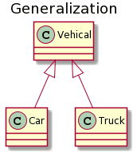

# 三大特性

## 封装

利用抽象数据类型将数据和基于数据的操作封装在一起，使其构成一个不可分割的独立实体。数据被保护在抽象数据类型的内部，尽可能地隐藏内部的细节，只保留一些对外接口使之与外部发生联系。用户无需知道对象内部的细节，但可以通过对象对外提供的接口来访问该对象。

**优点：**

- 减少耦合: 可以独立地开发、测试、优化、使用、理解和修改
- 减轻维护的负担: 可以更容易被程序员理解，并且在调试的时候可以不影响其他模块
- 有效地调节性能: 可以通过剖析确定哪些模块影响了系统的性能
- 以对成员变量进行更精确的控制
- 提高软件的可重用性
- 降低了构建大型系统的风险: 即使整个系统不可用，但是这些独立的模块却有可能是可用的
<!--truncate-->
## 继承

继承实现了 **IS-A** 关系。继承应该遵循里氏替换原则，子类对象必须能够替换掉所有父类对象。

- 子类拥有父类非 private 的属性、方法。
- 子类可以拥有自己的属性和方法，即子类可以对父类进行扩展。
- 子类可以用自己的方式实现父类的方法。
- super关键字：我们可以通过super关键字来实现对父类成员的访问，用来引用当前对象的父类。this关键字：指向自己的引用。
- 子父类中出现了同名的成员变量（成员方法）时，子类会优先访问自己对象中的成员变量（成员方法）。如果此时想访问父类成员变量（成员方法），可以使用super关键字。
- 子类是不继承父类的构造器的。构造方法的作用是初始化对象成员变量数据的，子类的构造方法中默认有一个`super()` ，表示调用父类的构造方法，父类成员变量初始化后，才可以给子类使用。如果父类只有带参数的构造器，则必须在子类的构造器中显式地通过 **super** 关键字调用父类的构造器并配以适当的参数列表。如果父类有无参的构造器，则在子类的构造器中不需要使用 **super** 关键字调用父类构造器，系统会自动调用父类的无参构造器。
- 使用 final 关键字声明类，就是把类定义定义为最终类，不能被继承，或者用于修饰方法，该方法不能被子类重写。
- 子类可以继承父类的私有成员（成员变量，方法），只是子类无法直接访问而已，可以通过getter/setter方法访问父类的private成员变量。

### 重写**(Override)**

子类中出现与父类一模一样的方法时（返回值类型，方法名和参数列表都相同），会出现覆盖效果，也称为重写或者复写。声明不变，重新实现。

- 参数列表与被重写方法的参数列表必须完全相同。
- 返回类型与被重写方法的返回类型可以不相同，但是必须是父类返回值的派生类。
- 子类方法覆盖父类方法，必须要保证权限大于等于父类权限。
- 重写方法不能抛出新的检查异常或者比被重写方法申明更加宽泛的异常。
- 声明为 static 的方法不能被重写，但是能够被再次声明。
- 声明为 final 的方法不能被重写。

### 重载(overloading)

- 被重载的方法必须改变参数列表(参数个数或类型不一样)。
- 被重载的方法可以改变返回类型，访问修饰符。
- 被重载的方法可以声明新的或更广的检查异常。
- 方法能够在同一个类中或者在一个子类中被重载
- 无法以返回值类型作为重载函数的区分标准。

## 多态

- **编译时多态：**方法的重载
- **运行时多态：**指程序中定义的对象引用所指向的具体类型在运行期间才确定。运行时多态有三个条件:继承、覆盖(重写)、向上转型

### ****多态的运行特点****

- 调用成员变量时：编译看左边，运行看左边
- 调用成员方法时：编译看左边，运行看右边

```java
Fu f = new Zi()；
//编译看左边的父类中有没有name这个属性，没有就报错
//在实际运行的时候，把父类name属性的值打印出来
System.out.println([f.name](http://f.name/));
//编译看左边的父类中有没有show这个方法，没有就报错
//在实际运行的时候，运行的是子类中的show方法
f.show();
```

### ****引用类型转换****

- 当使用多态方式调用方法时，首先检查父类中是否有该方法，如果没有，则编译错误。也就是说，**多态的写法就无法访问子类独有功能**。
- **向上转型**：多态本身是子类类型向父类类型向上转换（自动转换）的过程，这个过程是默认的。当父类引用指向一个子类对象时，便是向上转型。使用格式：`父类类型 变量名 = new 子类类型();`
- **向下转型**：父类类型向子类类型向下转换的过程，这个过程是强制的。一个已经向上转型了的子类对象，将父类引用转为子类引用，可以使用强制类型转换的格式，便是向下转型。使用格式：`子类类型 变量名 = (子类类型) 父类变量名;`

# 类图

## ****泛化关系 (Generalization)****

用来描述继承关系，在 Java 中使用 extends 关键字。



## ****实现关系 (Realization)****

用来实现一个接口，在 Java 中使用 implements 关键字。


## ****聚合关系 (Aggregation)****

表示整体由部分组成，但是整体和部分不是强依赖的，整体不存在了部分还是会存在。


## ****组合关系 (Composition)****

和聚合不同，组合中整体和部分是强依赖的，整体不存在了部分也不存在了。


## ****关联关系 (Association)****

表示不同类对象之间有关联，这是一种静态关系，与运行过程的状态无关，在最开始就可以确定。因此也可以用 1 对 1、多对 1、多对多这种关联关系来表示。


## ****依赖关系 (Dependency)****

和关联关系不同的是，依赖关系是在运行过程中起作用的。A 类和 B 类是依赖关系主要有三种形式:

- A 类是 B 类中的(某中方法的)局部变量；
- A 类是 B 类方法当中的一个参数；
- A 类向 B 类发送消息，从而影响 B 类发生变化；


# 类和对象

- 每个类都有构造方法。如果没有显式地为类定义构造方法，Java 编译器将会为该类提供一个默认构造方法。`import java.io.*;`将会命令编译器载入 java_installation/java/io 路径下的所有类。
- import 语句就是用来提供一个合理的路径，使得编译器可以找到某个类。
- 包主要用来对类和接口进行分类。
- this出现在实例方法中，谁调用这个方法（哪个对象调用这个方法），this就代表谁（this就代表哪个对象）。

## 源文件声明规则

- 一个源文件中只能有一个 public 类，可以有多个非 public 类
- 源文件的名称应该和 public 类的类名保持一致。
- 如果一个类定义在某个包中，那么 package 语句应该在源文件的首行。如果源文件包含 import 语句，那么应该放在 package 语句和类定义之间。如果没有 package 语句，那么 import 语句应该在源文件中最前面。
- import 语句和 package 语句对源文件中定义的所有类都有效。在同一源文件中，不能给不同的类不同的包声明。

## 抽象类

在面向对象的概念中，所有的对象都是通过类来描绘的，但是反过来，并不是所有的类都是用来描绘对象的，如果一个类中没有包含足够的信息来描绘一个具体的对象，这样的类就是抽象类。

- 抽象类不能实例化对象，所以抽象类必须被继承，才能被使用。
- 我们把没有方法体的方法称为抽象方法。如果一个类包含抽象方法，那么该类必须是抽象类。抽象类不一定有抽象方法，但是有抽象方法的类必须定义成抽象类。
- 继承抽象类的子类必须重写父类所有的抽象方法（我们将这种方法重写的操作，也叫做实现方法）。否则，该子类也必须声明为抽象类。
- 抽象类中，可以有构造方法，是供子类创建对象时，初始化父类成员使用的。
- 抽象类存在的意义是为了被子类继承，否则抽象类将毫无意义。抽象类可以强制让子类，一定要按照规定的格式进行重写。

## 接口

- 类与接口是实现关系，一个类可以同时实现多个接口。
- 接口与接口是继承关系，接口与接口之间是可以多继承的：也就是一个接口可以同时继承多个接口。接口继承接口就是把其他接口的抽象方法与本接口进行了合并。
- 实现类可以继承一个类的同时，再实现多个接口。
- 当两个接口中存在相同抽象方法的时候，只要重写一次即可。此时重写的方法，既表示重写1接口的，也表示重写2接口的。
- 接口是隐式抽象的，当声明一个接口的时候，不必使用**abstract**关键字。
- 接口中定义的变量会在编译的时候自动加上 `public static final` 修饰符，接口中的成员变量也只能是 ` **public static final** ` 类型的。
- 没有使用 `private`、`default` 或者 `static` 关键字修饰的方法是隐式抽象的，在编译的时候会自动加上 `public abstract` 修饰符。
- 从 Java 8 开始，接口中允许有**静态方法**，静态方法无法由（实现了该接口的）类的对象调用，它只能通过接口名来调用。接口中定义静态方法的目的是为了提供一种简单的机制，使我们不必创建对象就能调用方法，从而提高接口的竞争力。
- 从 Java 8 开始，接口中允许定义**默认方法**（必须由`default`修饰）。为实现该接口而不覆盖该方法的类提供默认实现。接口中定义默认方法让我们需要在所有的实现类中追加某个具体的方法时，不必挨个对实现类进行修改。
- 从 Java 9 开始，接口中允许定义**私有方法** *，使得某些复用的代码不会把方法暴露出去。*
- 类在实现接口的方法时，不能抛出强制性异常，只能在接口中，或者继承接口的抽象类中抛出该强制性异常。
- 如果实现接口的类是抽象类，那么就没必要实现该接口的方法。

### 标记接口

标记接口是没有任何方法和属性的接口。它仅仅表明它的类属于一个特定的类型，供其他代码来测试允许做一些事情。标记接口作用：简单形象的说就是给某个对象打个标（盖个戳），使对象拥有某个或某些特权。

- **建立一个公共的父接口：**
    
    正如`EventListener`接口，这是由几十个其他接口扩展的Java API，你可以使用一个标记接口来建立一组接口的父接口。例如：当一个接口继承了`EventListener`接口，Java虚拟机(JVM)就知道该接口将要被用于一个事件的代理方案。
    
- **向一个类添加数据类型：**
    
    这种情况是标记接口最初的目的，实现标记接口的类不需要定义任何接口方法(因为标记接口根本就没有方法)，但是该类通过多态性变成一个接口类型。
    

### 函数式接口

函数式接口(Functional Interface)就是一个有且仅有一个抽象方法，但是可以有多个非抽象方法的接口。将`@Functionallnterface`放在接口定义的上方，如果接口是函数式接口，编译通过；如果不是，编译失败。函数式接口可以对现有的函数友好地支持 lambda表达式。

## 内部类

将一个类A定义在另一个类B里面，里面的那个类A就称为**内部类**，B则称为**外部类**。

- 内部类可以使用多个实例，每个实例都有自己的状态信息，并与其他外部对象的信息相互独立。
- 在单个外部类中，可以让多个内部类以不同的方式实现同一个接口，或者继承同一个类。
- 创建内部类对象的时刻并不依赖于外部类对象的创建。
- 内部类并没有令人迷惑的“is-a”关系，他就是一个独立的实体。
- 内部类提供了更好的封装，除了该外部类，其他类都不能访问。

### **成员内部内**类

定义在了成员位置 (类中方法外称为成员位置，无static修饰的内部类)，属于外部类对象。

- 成员内部类可以被一些修饰符所修饰，比如： private，default，protected，public，static等。
- 在成员内部类里面，Java 16之前不能定义静态变量，Java 16开始才可以定义静态变量。
- 创建内部类对象时，对象中有一个隐含的`外部类名.this`记录外部类对象的地址值。
- 内部类的使用格式：`外部类.内部类;`。外部直接创建成员内部类的对象必须先得创建一个外部类的对象：`外部类.内部类 变量 = new 外部类（）.new 内部类（）;`。
- 内部类被private修饰，外界无法直接创建内部类的对象，只能在外部类中定义一个方法提供内部类的对象。
- 内部类如果想要访问外部类的成员变量，外部类的变量必须用final修饰。
- 内部类访问外部类对象的格式是：`外部类名.this`。

### **静态内部类**

定义在了成员位置 (类中方法外称为成员位置，有static修饰的内部类)，属于外部类。

- 静态内部类是一种特殊的成员内部类。
- 静态内部类可以直接访问外部类的静态成员。静态内部类不可以直接访问外部类的非静态成员，如果要访问需要创建外部类的对象。静态内部类中没有隐含的`外部类名.this`。
- 内部类的使用格式：`外部类.内部类;`。外部直接创建成员内部类的对象不用先创建一个外部类的对象：`外部类.内部类 变量 = 外部类.new 内部类（）;`。

### **局部内部类**

定义在一个方法或者一个作用域里面的类，所以局部内部类的生命周期仅限于作用域内。局部内部类就好像一个局部变量一样，它是不能被权限修饰符修饰的，比如说 public、protected、private 和 static 等。

### **匿名内部类**

没有名字的内部类，可以在方法中，也可以在类中方法外。

```java
new 类名或者接口名() {
重写方法;
};
```

包含了：1、继承或者实现关系；2、方法重写；3、创建对象

- 匿名内部类必须**继承一个父类**或者**实现一个父接口**。
- 通常在方法的形式参数是接口或者抽象类时，可以将匿名内部类作为参数传递。